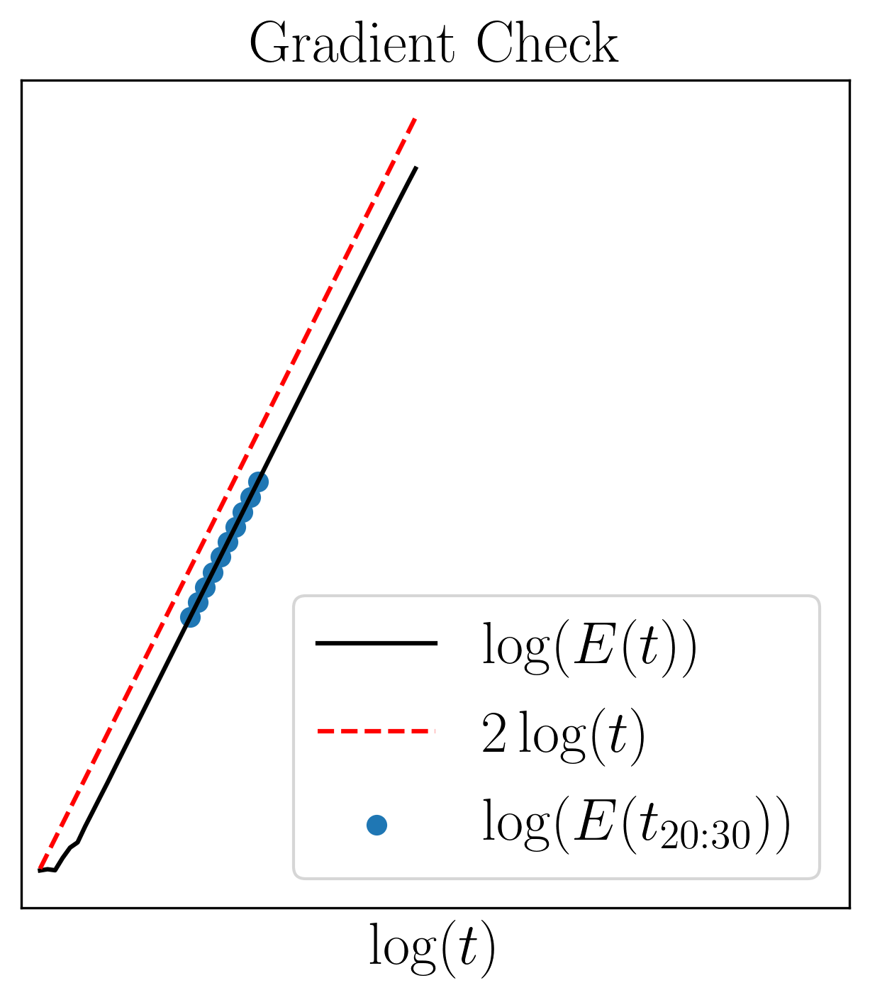
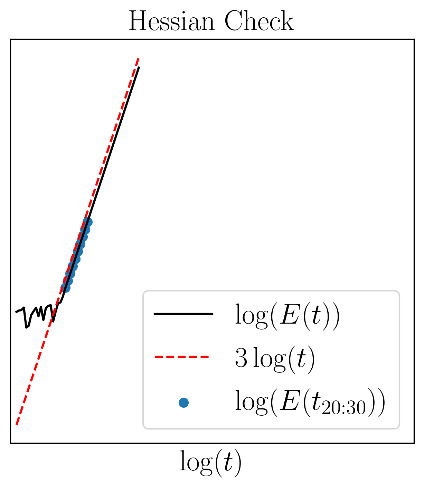

# Utils Library
Repository containing some utility frequently used inside different libraries.

## Authors/Maintainers
- Bernardo Fichera (bernardo.fichera@epfl.ch)

## Available Utils
- File Manager
- Timer
- Eigen Memory Allocation checker
- Derivative checker

## Usage
**utils-lib** is header only library. In order to use it just include the header relative to the utils you intend to use in your project.

### File Manager

### Timer

### Eigen Memory Allocation Check
In scenarios where we want to run application in real-time maintaining consistent frequency, runtime memory allocation is an important aspect. This is an utility based on Eigen Linear Algebra Library. It is inspired from [this](https://github.com/stulp/eigenrealtime) repo. Whenever you need to check if eigen is allocating memory at runtime include the utility header **before** including `Eigen`.

```c++
#include <utils_lib/RealtimeChecker.hpp>
#include <Eigen/Core>
```

Place the code where you want to avoid runtime memory allocation in between the macros `ENTERING_REAL_TIME_CRITICAL_CODE` and `EXITING_REAL_TIME_CRITICAL_CODE`. For instance

```c++
Eigen::MatrixXd a = Eigen::MatrixXd::Random(5, 5), b = Eigen::MatrixXd::Random(5, 5), c = Eigen::MatrixXd::Random(5, 5);

ENTERING_REAL_TIME_CRITICAL_CODE

// no memory allocation
a.noalias() += b * c;


// memory allocation
a += b * c;

EXITING_REAL_TIME_CRITICAL_CODE
```
The code will go through the first operation while it will crash in the second one where memory allocations happens. Check the example `eigen_malloc.cpp` to find more.

### Check Derivatives
This utility helps in numerically checking derivatives (up to second order). In order to check the gradient, the algorithm simply check that the taylor expansion up to the first derivative 
$$E(t) = | f(tv) - f(x) - t <\text{grad} f(x), v> | = O(t^2)$$
has a slope of approximately $2$ 
$$\log E(t) \approx 2 \log t + \text{constant}.$$
For the hessian check the taylor expansion up to the second derivative
$$E(t) = | f(tv) - f(x) - t <\text{grad} f(x), v> -\frac{t^2}{2} <\text{Hess} f(x)[v], v >| = O(t^3)$$
should approximately have a slope of $3$
$$\log E(t) \approx 3 \log t + \text{constant}.$$

First define your function and the derivative of it.
```c++
template <int size>
struct Function {
    double operator()(const Eigen::Matrix<double, size, 1>& x) const
    {
        return x(0) * x(0) * x(0);
    }
};

// grad f(x)
template <int size>
struct Gradient {
    Eigen::Matrix<double, size, 1> operator()(const Eigen::Matrix<double, size, 1>& x) const
    {
        return 3 * x * x;
    }
};
```
The utility is fully templated; you have the freedom to define you functions as structures with overloaded `()` operators, as shown above, lambda functions, `std::functions` wrapper or raw pointers. Define an instance of the utility (specifying the problem dimension) and then call the `checkGradient` method.
```c++
constexpr int dim = 1;
DerivativeChecker<long double> checker(dim);

bool grad_is_correct = checker.checkGradient(Function<dim>(), Gradient<dim>());
```
Check the example `check_derivative.cpp` to find more.


<p align="center">
  
  
</p>                                                                     

## ToDo
- add memory allocation monitoring (https://en.cppreference.com/w/cpp/types/alignment_of)
- introduce retraction based taylor expansion to check derivative on manifolds

## Dependencies
This library depends on **Eigen** linear algebra library to load data into *Eigen* vectors/matrices. For various utilities the library depends on **Corrade** utility library.

*Corrade* installation:
```sh
git clone https://github.com/mosra/corrade.git (git@github.com:mosra/corrade.git)
cd corrade && mkdir build && cmake .. && make && (sudo) make install
```
*Eigen* installation:
```sh
git clone https://gitlab.com/libeigen/eigen.git (git@gitlab.com:libeigen/eigen.git)
cd eigen && mkdir build && cmake .. && (sudo) make install
```

In addition, in order to compile the project, install my [waf-tools](https://github.com/nash169/waf-tools.git).

### Installation
Compile and install using waf commands
```sh
waf (./waf) configure build
```
or
```sh
waf (./waf) configure && waf (./waf)
```
Install the library (optional)
```sh
(sudo) waf (./waf) install
```
If you want to make a clean installation
```sh
(sudo) waf (./waf) distclean configure build install
```

#### Compilation options
In order to set the desired compiler define the environment variable CXX=<g++,clang++,icpc> (gnu, clang and intel compiler respectively).

AVX support with optimization flags is active by default. If you want disable this run the configure with `debug` flag:
```sh
waf (./waf) configure --debug
```
Compile static library (default option)
```sh
waf (./waf) configure --static
```
Compile shared library
```sh
waf (./waf) configure --shared
```
Define a specific installation path
```sh
waf (./waf) configure --prefix=/path/to/install/folder
```

### Examples
Once the library is compiled all the examples can be run with
```sh
./build/src/examples/<name_example>
```
